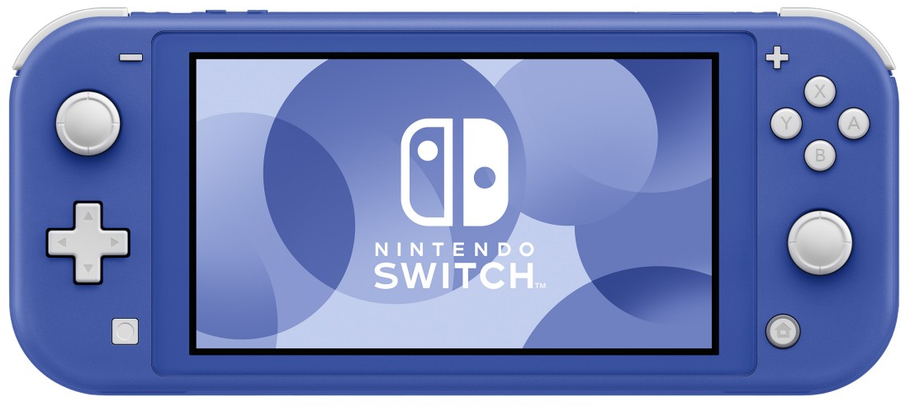
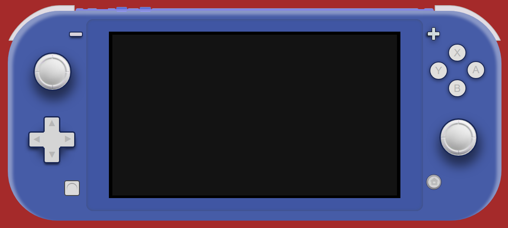
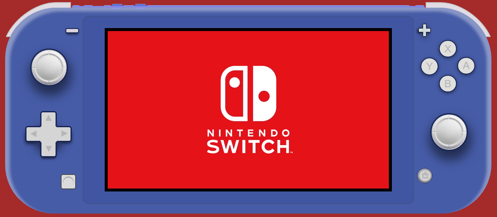

# <u>  Nintendo ® Switch Lite  </u>

El reto consiste en replicar una consola, en este caso he elegido la Nintendo Switch Lite (versión azul), la cual llegó a España en Mayo de 2021. De este modo ampliaron la gama de colores disponibles de la misma añadiendo el azul al amarillo, gris, turquesa y coral.

## Imagen del modelo en el que baso el reto:

## Tecnologias utilizadas:

   

## Interacción con el usiario
Pulsando el botón "home" se reproduce el tráiler del nuevo videojuego de la saga Zelda:  The Legend of Zelda: Tears of the Kingdom®

## COMO UTILIZAR
Para utilizar la Nintendo Switch Lite, abre el archivo index.html en tu navegador web  o haciendo click en este [enlace](https://rompetecla.github.io/proyecto01NintendoSwitchLite/).

Una vez cargada la página, pulsa el botón "home" para iniciar la reproducción del video.
  El resto de botones se pueden accionar pero no realizan ninguna función por el momento.

## PROCESO DE ELABORACIÓN
Para llevar a cabo este proyecto, primero se creó la base con un artivo .hmtl, una carpeta CSS, un archivo .css dentro de esta carpeta y una carpeta mas llamada IMG(donde alojaríamos todas las imgágenes necesarias)
A continuación se procedió a estructurar todo el cuerpo de la videoconsola en base a "div"(unos por separado y otros dentro de otros, haciendo así la estructura en "cajas" llamada "de padres a hijos") 
Luego se le fueron dando estilos en la hoja de .css para ir moldeando así la forma, color y profundidad mas parecida al modelo de referencia.
Por último se creó una carpeta en la raiz del proyecto llamada "mp4" donde alijaría el video del tráiler de Zelda. Se creó la hoja de java script para darle la función de reproducción del video y apareciera dentro de los margenes de la lcd cuando le pulsaramos al boton "boxhome".
Y para finalizar nos encontramos realizando el archivo README en el que me encuentro ahora mismo redactando.

## RESULTADO FINAL

### Sensaciones
Me lo he pasado muy bien dándole forma e investigando como podía hacer mejor este diseño. Me ha sabido a poco y por eso me he propuesto acabar perfeccionandolo, dándole un sentido al pulsar a cada boton. Incluso tengo el reto personal de intentar crearle una interfaz similar a la original en la que navegar utilizando dichos botones sin funciones.

## AUTOR
Javier Valiente Moreno ha sido el desarrollador de este proyecto como requisito para seguir avanzando con la formación por la academia GeeksHubs en su curso sobre "Full Stack Developer".

